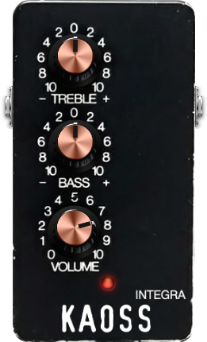

# Integra – LV2 Integrated Preamplifier

**A faithful emulation of the TC Electronic Integrated Preamplifier, optimized for the MOD Audio platform.**

This plugin is designed to provide simplicity, accurate control feel, and seamless integration with the MOD Audio ecosystem.

<p align="center">
  
</p>

---

## Features

*   **Accurate faceplate design:** The visual design closely resembles the original hardware for an authentic user experience.
*   **Faceplate-accurate controls:** The plugin's knobs match the behaviour of the original pedal's knobs.
*   **Bass / Treble:** Each control uses a first-order shelving filter with +/-15 dB of gain available internally.
*   **Volume:** Displayed 0..10 control whose internal taper is cubic and maps to an audio gain range roughly -90 dB .. +25 dB. Unity gain is approximately Volume = 3.80.
*   **Dynamic filter frequencies:** Treble and Bass frequency centers shift with knob position to better emulate the hardware's behavior (e.g., Treble moves from ~600 Hz to several kHz depending on the knob position).
*   **Analog-style Low-pass:** A gentle analog-style low-pass filter (18 kHz) is applied at the output for realistic rolloff.

---

## Quick Settings

Here are some quick recommended settings to get started with the Integra plugin, as well as achieve some recognisable tones:

#### Clean Boost
- **Bass:** 0
- **Treble:** 0
- **Volume:** 5 (or as per taste)

#### Early Meshuggah Tones
- **Bass:** -10
- **Treble:** +2 (or higher)
- **Volume:** 4.5 (or higher)

#### Fortin Grind/33 Emulation
- **Bass:** -10
- **Treble:** -3 to -4
- **Volume:** 6 (or as per taste)

---

## Installation

For most users, it is recommended to download the pre-built plugin from the **[Releases Page](https://github.com/theKAOSSphere/integra/releases)**.

1.  Go to the [Releases Page](https://github.com/theKAOSSphere/integra/releases).
2.  Download the latest `integra.lv2-vx.x.tgz` file.
3.  Unzip the file. You will have a folder named `integra.lv2`.

### For MOD Audio Devices

1.  **Transfer the Plugin:** Copy the entire `integra.lv2` directory from your computer to your MOD Audio device. You can use `scp` for this:
    ```bash
    # Example command from your Downloads folder
    scp -r ~/Downloads/integra.lv2 root@192.168.51.1:/data/plugins/
    ```
2.  **Restart the Host:** Connect to your device via `ssh` and restart the `mod-host` service:
    ```bash
    ssh root@192.168.51.1
    systemctl restart mod-host
    ```
3.  **Refresh the Web UI:** Reload the MOD web interface in your browser. Integra should now be available.

### For Linux Desktops

1.  **Copy the LV2 Bundle:** Copy the `integra.lv2` folder to your user's LV2 directory.
    ```bash
    cp -r ~/Downloads/integra.lv2 /path/to/lv2/directory/
    ```
2.  **Scan for Plugins:** Your LV2 host (e.g., Ardour, Carla) should automatically detect the new plugin on its next scan.

---

## Building From Source

<details>
<summary><strong>► Build for MOD Audio Devices (using mod-plugin-builder)</strong></summary>

This project is configured to be built using the **`mod-plugin-builder`** toolchain. For more details on setting up the MOD Plugin Builder, please refer to the [mod-plugin-builder](https://github.com/mod-audio/mod-plugin-builder) repository.

#### Prerequisites

1.  A functional **MOD Plugin Builder** environment.
2.  The necessary build dependencies (`libtool`, `pkg-config`) are handled by the buildroot environment.

#### Build Steps

1.  **Clone the Repository:**
    Place the `integra` repository inside the `plugins/package` directory of your `mod-plugin-builder` folder.
    ```bash
    cd /path/to/mod-plugin-builder/plugins/package
    git clone https://github.com/theKAOSSphere/integra
    ```
2.  **Run the Build:**
    Navigate to the root of the `mod-plugin-builder` and run the build command, targeting `integra`.
    ```bash
    cd /path/to/mod-plugin-builder
    ./build <target> integra
    ```
    Replace `<target>` with your device target (e.g., `modduox-new`). The compiled bundle will be located in the `/path/to/mod-workdir/<target>/target/usr/local/lib/lv2` directory. You can then follow the installation instructions to transfer it to your device.

</details>

<details>
<summary><strong>► Build for Linux Desktop (Standalone)</strong></summary>

For testing on a standard Linux desktop without the MOD toolchain.

### Prerequisites

You must have the necessary development libraries installed. On a Debian-based system (like Ubuntu), you can install them with:
```bash
sudo apt-get update
sudo apt-get install build-essential libtool pkg-config lv2-dev
```

### Build Steps

1.  **Navigate to the Source Directory:**
    ```bash
    cd source/
    ```
2.  **Compile the Plugin:**
    ```bash
    make
    ```
    An `integra.lv2` bundle will be created inside the `source/` directory. You can then follow the desktop installation instructions to copy it to `/path/to/lv2/directory/`.
</details>

---

## License

This plugin is licensed under GPLv3. See the `LICENSE` file for details. The project contains the `SPDX-License-Identifier: GPL-3.0-or-later` header in the source files.